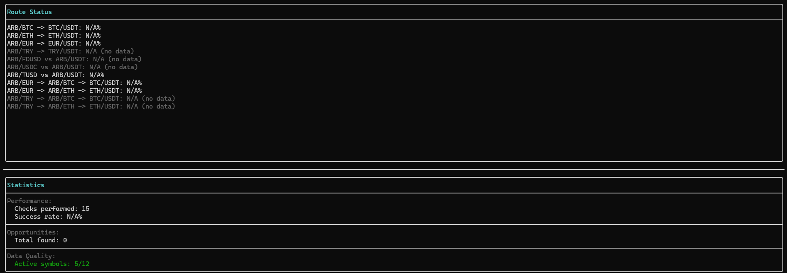
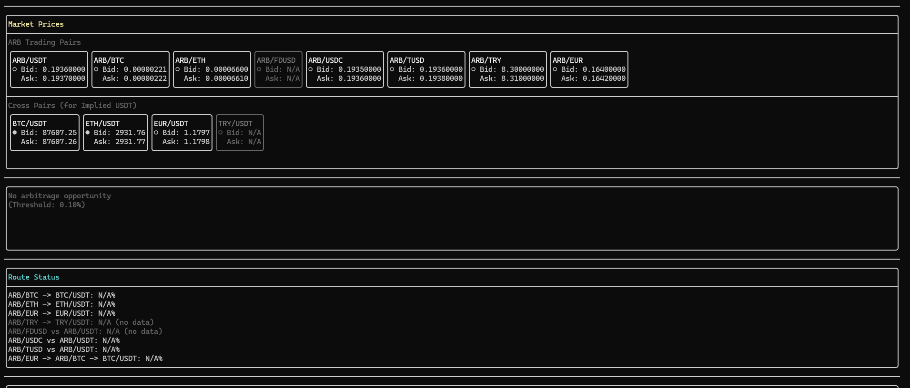

# Binance ARB Arbitrage Engine

A high-performance C++17 arbitrage detection system for Binance Spot market, specifically designed to monitor ARB (Arbitrum) trading pairs and identify profitable arbitrage opportunities in real-time.

## Overview

This project implements a real-time arbitrage detection engine that:
- Connects to Binance WebSocket API to receive live market data
- Monitors 8 ARB trading pairs (ARB/USDT, ARB/FDUSD, ARB/USDC, ARB/TUSD, ARB/BTC, ARB/ETH, ARB/TRY, ARB/EUR)
- Calculates implied USDT prices across different trading routes
- Detects arbitrage opportunities with configurable profit thresholds
- Supports direct, 2-leg, triangular, and multi-leg arbitrage paths

## Requirements

### Required Software

- **CMake**: Version 3.14 or higher
- **Visual Studio**: 2022 (Community, Professional, or Enterprise)
- **vcpkg**: Latest version (for dependency management)
- **Git**: For cloning vcpkg repository

### Required Libraries

- **Boost**: Version 1.84.0 or higher
  - Components: `boost-beast`, `boost-system`
- **OpenSSL**: Version 3.6.0 or higher
- **FTXUI**: Latest version (Terminal UI library)

### C++ Standard

- **C++17** or higher

## Installation

### Automatic Setup (Recommended)

Run the setup script to automatically install all dependencies and configure the project:

```powershell
# Clone the repository (if not already cloned)
git clone <repository-url>
cd <project-directory>

# Run setup script
.\setup.ps1
```

The script will automatically:
- Check for Git and CMake (required tools)
- Install vcpkg from GitHub (if not already installed)
- Install all required dependencies via vcpkg:
  - Boost.Beast (WebSocket client)
  - Boost.System (system error handling)
  - OpenSSL (SSL/TLS support)
  - FTXUI (Terminal UI library)
- Configure CMake with vcpkg toolchain
- Create build directory

**Note**: First-time installation may take 10-15 minutes.

**Custom vcpkg path**: If vcpkg is installed at a different location, you can specify it:
```powershell
.\setup.ps1 -VcpkgPath "C:\path\to\vcpkg"
```

### Manual Setup

If you prefer manual installation:

#### Step 1: Install vcpkg

If you don't have vcpkg installed:

```powershell
git clone https://github.com/microsoft/vcpkg.git D:\vcpkg
cd D:\vcpkg
.\bootstrap-vcpkg.bat
.\vcpkg integrate install
```

#### Step 2: Install Dependencies

Install required libraries using vcpkg:

```powershell
<vcpkg-path>\vcpkg.exe install boost-beast:x64-windows boost-system:x64-windows openssl:x64-windows ftxui:x64-windows
```

This will install:
- Boost.Beast (WebSocket client library)
- Boost.System (system error handling)
- OpenSSL (SSL/TLS support)
- FTXUI (Terminal UI library)

**Note**: Installation may take 10-15 minutes on first run.

#### Step 3: Clone and Build Project

```powershell
# Navigate to project directory
cd <project-directory>

# Create build directory
mkdir build
cd build

# Configure CMake with vcpkg toolchain
cmake .. -DCMAKE_TOOLCHAIN_FILE=<vcpkg-path>\scripts\buildsystems\vcpkg.cmake

# Build the project
cmake --build . --config Debug
```

### Step 4: Run the Application

```powershell
cd Debug
.\arb_engine.exe
```

## Project Structure

```
C++/
├── CMakeLists.txt              # CMake build configuration
├── main.cpp                    # Application entry point
├── README.md                   # This file
├── case.md                     # Project requirements document
└── src/
    └── net/
        ├── WebSocketClient.hpp # WebSocket client header
        └── WebSocketClient.cpp # WebSocket client implementation
```

## Architecture

### Components

#### WebSocketClient
Handles secure WebSocket connections to Binance API:
- SSL/TLS handshake and certificate validation
- Real-time market data reception (bookTicker stream)
- Thread-safe data handling
- Automatic reconnection with exponential backoff
- Connects to `wss://stream.binance.com:443/ws/<symbol>@bookTicker`

#### MarketState
Centralized thread-safe storage for all order book data:
- Manages `OrderBook` instances for each symbol
- Provides thread-safe access to market data
- Tracks real-time bid/ask prices and quantities

#### OrderBook
Thread-safe order book representation:
- Stores best bid/ask prices and quantities
- Tracks timestamp for data freshness
- Provides snapshot interface for reading

#### ArbitrageDetector
Core arbitrage detection engine:
- Calculates implied USDT prices across routes
- Detects 2-leg, multi-leg, and direct comparison opportunities
- Configurable profit threshold (default: 0.10%)
- Supports all ARB trading pairs

#### ArbitrageUI
Interactive terminal UI using FTXUI:
- Real-time market data visualization
- Price change indicators (green/red/white)
- Route status monitoring
- Performance statistics
- Mouse wheel scrolling support

#### ArbitrageLogger
Automatic JSON logging for arbitrage opportunities:
- Saves detected opportunities to timestamped JSON files
- Filename format: `arbitrage_YYYY-MM-DD_HH-MM-SS.json`
- Includes complete opportunity data (route, profit, prices, max tradable amount)
- Thread-safe logging from detection thread
- No external JSON library dependency (manual JSON construction)

## Screenshots

### User Interface Overview

The application provides a comprehensive terminal-based interface for monitoring arbitrage opportunities in real-time.


*Figure 1: Real-time market data display showing ARB trading pairs, cross pairs, route status, and system statistics.*


*Figure 2: Detailed view of the arbitrage detection system with route monitoring and opportunity tracking.*

### JSON Logging

When an arbitrage opportunity is detected, the system automatically saves it to a JSON file in the project root directory. Each opportunity is saved to a separate file with a timestamped filename:

**Filename Format:** `arbitrage_YYYY-MM-DD_HH-MM-SS.json`

**JSON Structure:**
```json
{
  "timestamp_ms": 1704067200000,
  "timestamp": "2024-01-01 12:00:00",
  "direction": 1,
  "route_name": "ARB/BTC -> BTC/USDT",
  "trade_sequence": "Buy ARB/BTC -> Buy BTC/USDT -> Sell ARB/USDT",
  "profit_percent": 0.15,
  "max_tradable_amount": 1234.56,
  "max_tradable_currency": "ARB",
  "prices": {
    "arb_usdt_bid": 0.19360000,
    "arb_usdt_ask": 0.19370000,
    "arb_other_bid": 0.00000221,
    "arb_other_ask": 0.00000222,
    "other_usdt_bid": 87607.25,
    "other_usdt_ask": 87607.26
  }
}
```

**Fields:**
- `timestamp_ms`: Unix timestamp in milliseconds
- `timestamp`: Human-readable timestamp
- `direction`: Trade direction (1 or 2)
- `route_name`: Trading route identifier
- `trade_sequence`: Step-by-step trade sequence
- `profit_percent`: Calculated profit percentage
- `max_tradable_amount`: Maximum tradable amount (order book depth analysis)
- `max_tradable_currency`: Currency of max tradable amount
- `prices`: All relevant bid/ask prices for the opportunity

**Note:** JSON files are created automatically when opportunities are detected. No manual intervention required.

### Data Format

The system receives `bookTicker` messages in the following format:

```json
{
  "u": 6269001103,           // Order book update ID
  "s": "ARBUSDT",            // Symbol
  "b": "0.19030000",         // Best bid price
  "B": "82823.10000000",     // Best bid quantity
  "a": "0.19040000",         // Best ask price
  "A": "27169.70000000"      // Best ask quantity
}
```

## Usage

### Basic Usage

```cpp
#include "src/net/WebSocketClient.hpp"

int main() {
    // Create WebSocket client for ARBUSDT bookTicker stream
    WebSocketClient ws("arbusdt@bookTicker");
    
    // Start receiving data
    ws.start();
    
    // Keep running...
    std::this_thread::sleep_for(std::chrono::seconds(10));
    
    // Stop and cleanup
    ws.stop();
    
    return 0;
}
```

### Supported Symbols

The WebSocket client can connect to any Binance `bookTicker` stream:

- `arbusdt@bookTicker` - ARB/USDT
- `arbbtc@bookTicker` - ARB/BTC
- `arbeth@bookTicker` - ARB/ETH
- `arbusdc@bookTicker` - ARB/USDC
- `arbfdusd@bookTicker` - ARB/FDUSD
- `arbtusd@bookTicker` - ARB/TUSD
- `arbtry@bookTicker` - ARB/TRY
- `arbeur@bookTicker` - ARB/EUR

## Build Configuration

### Debug Build

```powershell
cmake --build . --config Debug
```

### Release Build

```powershell
cmake --build . --config Release
```

### CMake Options

- `CMAKE_TOOLCHAIN_FILE`: Path to vcpkg toolchain file (required)
- `CMAKE_BUILD_TYPE`: Build type (Debug/Release)

## Dependencies

### Boost Libraries

- **Boost.Beast**: Header-only WebSocket and HTTP library
- **Boost.System**: System error codes and error handling
- **Boost.Asio**: Asynchronous I/O operations

### OpenSSL

- **OpenSSL**: SSL/TLS cryptographic library for secure connections

### FTXUI

- **FTXUI**: Functional Terminal User Interface library for interactive console UI

## Troubleshooting

### CMake Cannot Find Boost

**Error**: `Boost gerekli! Lutfen yukleyin.`

**Solution**: 
1. Ensure vcpkg is installed and dependencies are installed
2. Run CMake with vcpkg toolchain:
   ```powershell
   cmake .. -DCMAKE_TOOLCHAIN_FILE=D:\vcpkg\scripts\buildsystems\vcpkg.cmake
   ```

### OpenSSL Not Found

**Error**: `OpenSSL gerekli! Lutfen yukleyin.`

**Solution**:
```powershell
<vcpkg-path>\vcpkg.exe install openssl:x64-windows
```

### WebSocket Connection Failed

**Possible Causes**:
- Network connectivity issues
- Binance API endpoint changes
- Firewall blocking WebSocket connections

**Solution**: Check network connection and firewall settings.

### Compilation Errors

**Error**: `'boost/beast/websocket.hpp' file not found`

**Solution**: Ensure Boost.Beast is installed via vcpkg:
```powershell
<vcpkg-path>\vcpkg.exe install boost-beast:x64-windows
```

## Development

### Code Standards

- **Naming Conventions**:
  - Classes: PascalCase
  - Methods: camelCase
  - Variables: snake_case
  - Private members: trailing underscore
  - Constants: ALL_CAPS

- **C++17 Features**:
  - Smart pointers (`std::unique_ptr`, `std::shared_ptr`)
  - RAII for resource management
  - `std::thread` for concurrency
  - `std::mutex` for thread synchronization
  - No raw `new`/`delete`
  - No global variables
  - No magic numbers

### Adding New Features

1. Create new source files in appropriate directories
2. Update `CMakeLists.txt` if needed (automatic with `file(GLOB)`)
3. Follow existing code style and conventions
4. Test with Debug build first

## Implemented Features

✅ **Core Functionality:**
- OrderBook implementation for maintaining bid/ask levels
- PriceCalculator for implied USDT price calculation
- Router for generating arbitrage paths
- ArbitrageEngine for opportunity detection
- Support for all 8 ARB pairs simultaneously
- Multi-leg arbitrage detection (3+ legs)
- Profit threshold configuration (0.10% default)
- Real-time WebSocket data streaming
- Automatic reconnection with exponential backoff
- Interactive terminal UI (FTXUI)
- Price change visualization (green/red/white)
- Route status monitoring
- **Automatic JSON logging** - All detected opportunities are saved to timestamped JSON files
- Performance statistics

## Future Enhancements

- [x] Order book depth analysis (max tradable amount calculation) ✅
- [ ] Structured logging system
- [ ] Configuration file support
- [ ] Historical data analysis
- [ ] Performance optimization

## License

This project is developed for educational and research purposes.

## References

- [Binance WebSocket API Documentation](https://developers.binance.com/docs/binance-spot-api-docs/web-socket-streams)
- [Boost.Beast Documentation](https://www.boost.org/doc/libs/1_84_0/libs/beast/doc/html/index.html)
- [CMake Documentation](https://cmake.org/documentation/)
- [vcpkg Documentation](https://vcpkg.io/)


